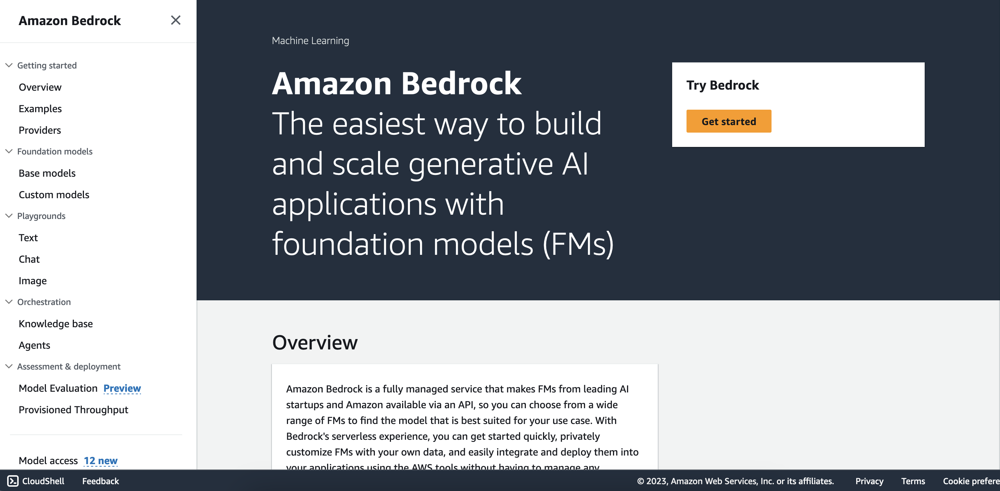
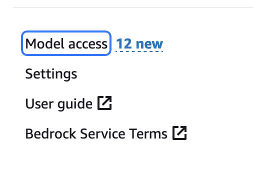
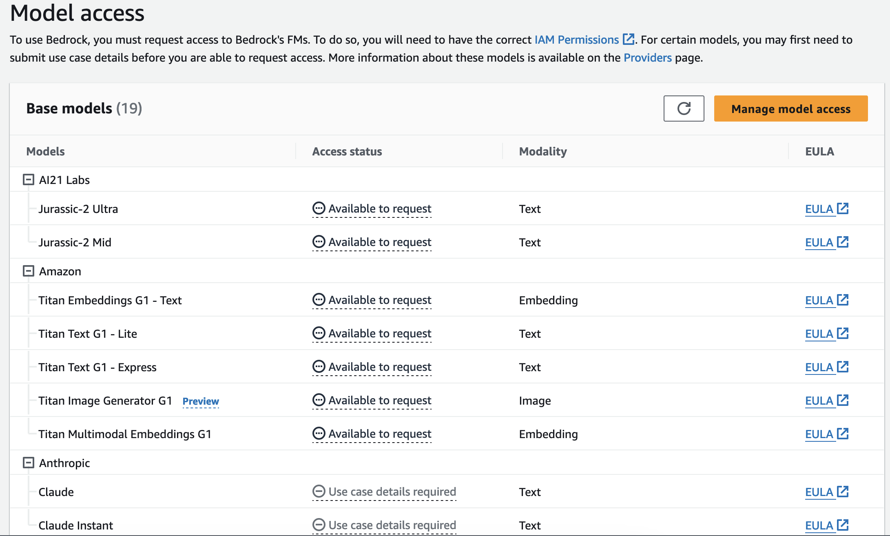

# Cranking Up Bedrock

Getting access to the various Bedrock Models, requires 

## Prerequisites

Before you begin, you have to set up the following things - you can find the detailed instruction further down below.

1. Have an AWS Account
1. Enable the Bedrock Largue Language Models
1. Set up the right permission and fetch the API Key

## 1. **Create an AWS Account:**
    
 Refer to the AWS Account Creation Documentation for a detailed [guide](https://docs.aws.amazon.com/accounts/latest/reference/manage-acct-creating.html).

>Note: A credit card is required for account creation, but you won't be billed for this step.

:warning:

> Because of the critical nature of the root user of the account, we strongly recommend that you use an email address that can be accessed by a group, rather than only an individual. That way, if the person who signed up for the AWS account leaves the company, the AWS account can still be used because the email address is still accessible. If you lose access to the email address associated with the AWS account, then you can't recover access to the account if you ever lose the password.

## 2. **Enable Access to Bedrock Large Language Models:**
    
*   Go to the AWS console.
*   Navigate to Bedrock and select 'Settings'.
*   Enable the models you wish to use.
*   For detailed instructions, see [Model Access Documentation](https://docs.aws.amazon.com/bedrock/latest/userguide/model-access.html).

## 3. Set Up Permissions and get the API Key
    
*Note: This template should work in all regions, not limited ot the region Bedrock is available. In the selected region the Access Token is going to be stored in AWS Secrets Manager.*

Simply click one of the buttons, for the desired region and follow the instructions.

| Region |     | CloudFormation Stack |
| ---    | --- | --- |
| US East (N. Virginia) | **us-east-1** |  |
| Europe (Frankfurt) | **eu-central-1** |  |

#### Supported Regions
*Note: Models vary by region.*

>- Europe (Frankfurt)
>- US West (Oregon)
>- Asia Pacific (Tokyo)
>- Asia Pacific (Singapore)
>- US East (N. Virginia)

## Step by Step Guide with Screens

Simply log into the AWS Console and select your preferred region.

*Note* Please keep the supported regions and models per regions in mind.

Once logged in, navigate to the Amazon Bedrock.

You should view this screen:

Now to request access, go to the left-hand navigation and click Model access, as depicted here:

>To get a better idea of the models available, and what each does, on the left-hand navigation, click Base models.

You should see this page, from which you can request model access:

By clicking on **Manage model access** you can request the models you’d like access to, and then click **Save changes**.

*Note You won’t be charged for just having access to the model; charges only accrue when you use the model. Also, not all models will be available, and some (like Claude) will require you to submit a use case before access is granted.*