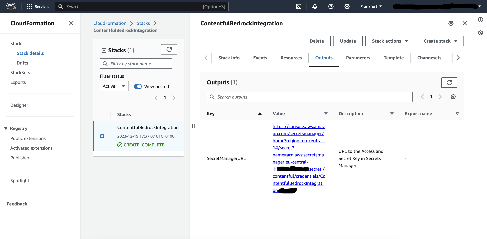

# AI Made Easy: Powering Contentful with Amazon Bedrock in One Click

This guide will help you to setup your AWS account for Contentful to access Amazon Bedrock. To gain access to various Bedrock Models the only prerequisite is to have an AWS account.

Amazon Bedrock is a fully managed service and it is serverless in nature that provides a selection of high-performing foundation models (FMs) from leading AI companies, including AI21 Labs, Anthropic, Cohere, Meta, Stability AI, and Amazon itself. The service offers a unified API and a range of features to simplify the development of generative AI applications, making it accessible to a wider range of users without compromising on privacy and security.

## Prerequisites

 Refer to the AWS Account Creation Documentation for a detailed [guide](https://docs.aws.amazon.com/accounts/latest/reference/manage-acct-creating.html).

> Note: A credit card is required for account creation, but you won't be billed for this step.
> :warning:
> Because of the critical nature of the root user of the account, we strongly recommend that you use an email address that can be accessed by a group, rather than only an individual. That way, if the person who signed up for the AWS account leaves the company, the AWS account can still be used because the email address is still accessible. If you lose access to the email address associated with the AWS account, then you can't recover access to the account if you ever lose the password.

## Cost

Deployment of this template will vary by region, the cost will occur for a managed secret (the Access and Secret Keys that are generated) - feel free to delete the secret after you stored them securely.
Usage of Bedrock will incur cost. Please see the [Amazon Bedrock pricing](https://aws.amazon.com/de/bedrock/pricing/) page for details.

## Setup instructions

## 1. **Enable Access to Bedrock Large Language Models:**
    
*   Go to the AWS console.
*   Navigate to Bedrock and select 'Model access' from the left hand menu. 
*   Enable the models you wish to use.
*   For detailed instructions, see [Model Access Documentation](https://docs.aws.amazon.com/bedrock/latest/userguide/model-access.html).

## 2. Set Up Permissions and get the API Key
    
*Note: This template should work in all regions, not limited ot the region Bedrock is available. In the selected region the Access Token is going to be stored in AWS Secrets Manager.*

Simply click one of the buttons, for the desired region and follow the instructions.

Once the stack completes you can find a link to the credentials in the `output` tab. Simply click the link and save the credentials in your Contentful application. You can delete the secret afterwards from Secrets Manager (this secret would otherwise cost a small amount for each month of usage).

| Region |     | CloudFormation Stack |
| ---    | --- | --- |
| US East (N. Virginia) | **us-east-1** |  |
| Europe (Frankfurt) | **eu-central-1** |  |
| Use currently active region | --- |  |

#### Supported Regions
*Note: Models vary by region.*

>- Europe (Frankfurt)
>- US West (Oregon)
>- Asia Pacific (Tokyo)
>- Asia Pacific (Singapore)
>- US East (N. Virginia)

## 4. Detailed step by step guide with screenshots

Simply log into the AWS Console and select your preferred region.

*Note* Bedrock is not supported in all regions, and the availablity for models may vary by region. Please select the region that matches your needs. The access key won't be limited to a region - you may use the same key for multiple regions. You will have to request model access for each region.

Once logged in, navigate to the Amazon Bedrock.

You should view this screen:

Now to request access, go to the left-hand navigation and click Model access, as depicted here:

>To get a better idea of the models available, and what each does, on the left-hand navigation, click Base models.

You should see this page, from which you can request model access:

By clicking on **Manage model access** you can request the models you’d like access to, and then click **Save changes**.

*Note You won’t be charged for just having access to the model; charges only accrue when you use the model. Also, not all models will be available, and some (like Claude) will require you to submit a use case before access is granted.*

## Further Documentation ##

This [Blog Post](https://community.aws/content/2ZAHJMCN4Ffi6W2DPJFIgq8MHkX/aws-bedrock---learning-series---blog-1) goes into further details on how to set up Bedrock.
